<!-- Live animated contribution heatmap: scraped directly from public data,
     rounded SVG boxes with diagonal slide reveal, updated daily via GitHub Actions -->
<h3><code>umang@github ~ $ ./contributions.sh</code></h3>

  

<!-- Hero: Monochrome self-typing ASCII portrait paired with Neofetch terminal card.
     Widths (370 + 490 = 860) match the heatmap width above for clean alignment. -->
<h3><code>umang@github ~ $ whoami</code></h3>
<table>
  <tr>
    <td valign="top"></td>
    <td valign="top"></td>
  </tr>
</table>

